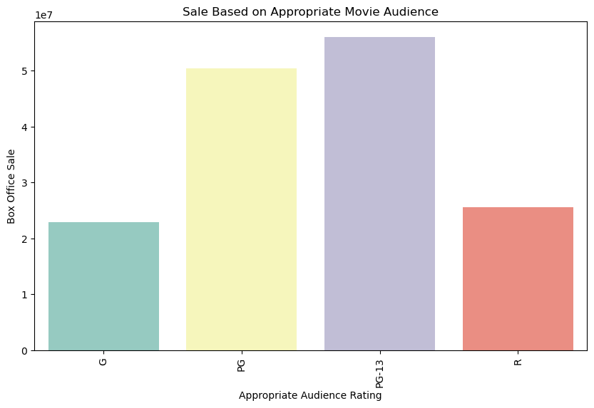
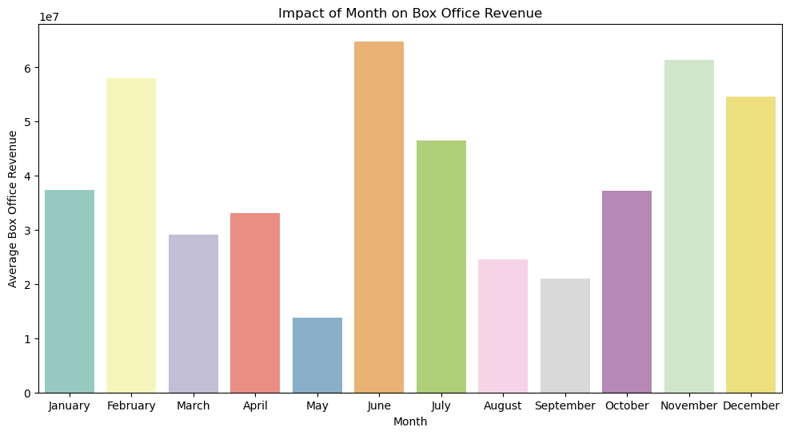
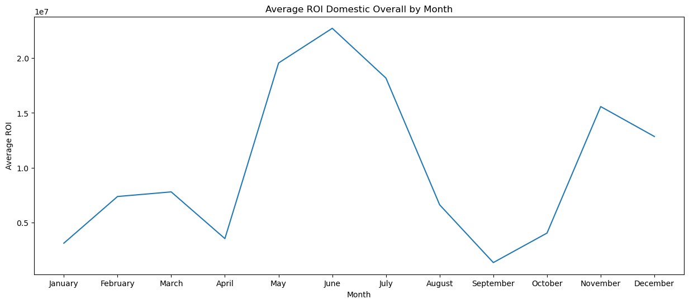

# Movie Analysis for Movie Production
**Author**: Cristopher Delgado 

## Overview 
This project analyzes movie characteristics such as genres, return on investment (ROI), and ratings. The data analysis performed in this repository is based on datasets from [Box Office Mojo](https://www.boxofficemojo.com/), [IMDB](https://www.imdb.com/), [Rotten Tomatoes](https://www.rottentomatoes.com/), [TheMovieDB](https://www.themoviedb.org/), and [The Numbers](https://www.the-numbers.com/).  
## Buisness Problem
Microsoft sees all the big companies creating original video content and they want to get in on the fun. They have decided to create a new movie studio, but they don’t know anything about creating movies. You are charged with exploring what types of films are currently doing the best at the box office. You must then translate those findings into actionable insights that the head of Microsoft's new movie studio can use to help decide what type of films to create.
> ### Buisness Understanding 
> Microsoft wants to enter the movie production business however as a rookie in this business they need insight on audience opinions about characteristics about movies. Audience opinions impact ROI. In addition to learning about what an audience enjoys, Microsoft must also consider when to release their movies to get the most ROI. 
## Data
## Methods
## Results 
The [popularity score](https://developer.themoviedb.org/docs/popularity-and-trending) is a unique characteristic property in the TMDB dataset. 

The popularity score is the lifelong culmination of: 
- Number of votes for the day 
- Number of viewsd for the day
- Number of users who marked it as a 'favourite' for the day 
- Release date
- Number of total votes 
- Accounts for the previous days score

It was essential to consider this score from the TMDB dataset to trulty factor in many factors calculated by TMDB. This score is a good representation of popularity over the movies lifetime since the release date. Taking this score into consideration we can determine which genres are the most popular. 

Sales are important in movie production as this will determine the ROI. Considering a movies characteristics such as intended audience and its release date can impact its Box Office Sale. As we can see PG-13 movies and PG make the most Box Office Sales which can make the most ROI. Releasing a movie at a certain tim of the year can impact the Box Office Sales as we can see below. 

## Conclusion
This analysis hgas lead to three recommendations for Microsofts's new movie production studio:

- **Make movies with the following genres: Western, Romance, History, Animation, Family, Mystery, Thriller, Science Fiction, War, Crime, Fantasy, Action, Adventure.** These genres had a popularity score of 40 percent or higher which according to TMDB is considered good through excellent. 
- **Make movies with the intended Audience of PG-13 and PG.** These intended audience ratings proved to have the higher box office sales in comparison to rated R and G movies. 
- **Release movies in the summer time as well as the end of the year.** The time of the year matters when releasing movies. We can see this occur in the months of May, June, July, November, December and February. 

### Next Steps
Further analysis can provide additional insights for Microsoft and there new movie production studio. Other exploratory routes to take can be the following directions: 
- Explore the ROI based on director for the movie. Directors are important to any movie production as they will be the ones to organize and envision movie scenes and guide its production. The main goal is to pick the best director. 
- Create a model where you can predict the best years to release movies. Evnetually any movie studio will have to create an organized timeline for movie releases especially if sequels are made. Predicting a year to release movies can be crucial to obtain the most ROI.