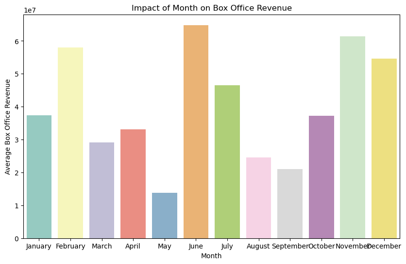

# Movie Analysis for Movie Production
**Author**: Cristopher Delgado 

## Overview 
This project analyzes movie characteristics such as genres, return on investment (ROI), and ratings. The data analysis performed in this repository is based on datasets from [Box Office Mojo](https://www.boxofficemojo.com/), [IMDB](https://www.imdb.com/), [Rotten Tomatoes](https://www.rottentomatoes.com/), [TheMovieDB](https://www.themoviedb.org/), and [The Numbers](https://www.the-numbers.com/).  
## Buisness Problem
Microsoft sees all the big companies creating original video content and they want to get in on the fun. They have decided to create a new movie studio, but they don’t know anything about creating movies. You are charged with exploring what types of films are currently doing the best at the box office. You must then translate those findings into actionable insights that the head of Microsoft's new movie studio can use to help decide what type of films to create.
> ### Buisness Understanding 
> Microsoft wants to enter the movie production business however as a rookie in this business they need insight on audience opinions about characteristics about movies. Audience opinions impact ROI. In addition to learning about what an audience enjoys, Microsoft must also consider when to release their movies to get the most ROI. 
## Data
## Methods
## Results 
The [popularity score](https://developer.themoviedb.org/docs/popularity-and-trending) is a unique characteristic property in the TMDB dataset. 

The popularity score is the lifelong culmination of: 
- Number of votes for the day 
- Number of viewsd for the day
- Number of users who marked it as a 'favourite' for the day 
- Release date
- Number of total votes 
- Accounts for the previous days score

It was essential to consider this score from the TMDB dataset to trulty factor in many factors calculated by TMDB. This score is a good representation of popularity over the movies lifetime since the release date. Taking this score into consideration we can determine which genres are the most popular. 

## Conclusion
### Next Steps